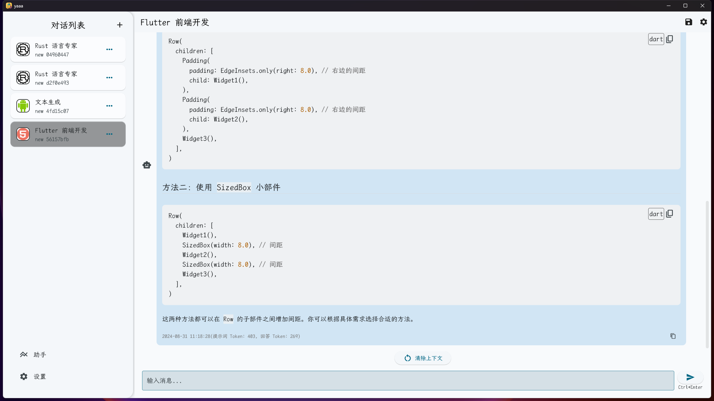

# yaaa

Yet Another AI Assistant. A toy project while learning Flutter.

## Supported Features

- ✅ Multi-Platform Support (Android, Windows, ...)
- ✅ Multi-LLM Support (OpenAI, DeepSeek)
- ✅ Customizable Prompt
- ✅ StreamApi
- ✅ Continuous Conversation
- ✅ Markdown and Latex Support
- ✅ Dark Mode
- ✅ Keyboard Shortcuts
- ✅ Multi-Language Support

## Noted

**This project is still in development, so there are many bugs and missing features. If you have any ideas or suggestions, feel free to open an issue or pull request.**

## License

No intention to commercialize. This project is licensed under the MIT License - refer to the [LICENSE-MIT](LICENSE-MIT) file for detailed information.
