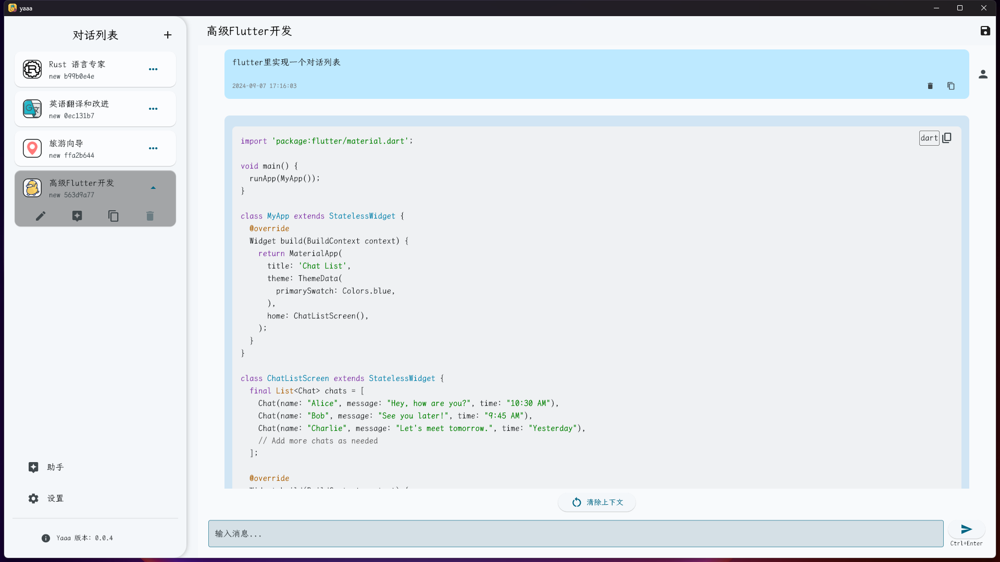
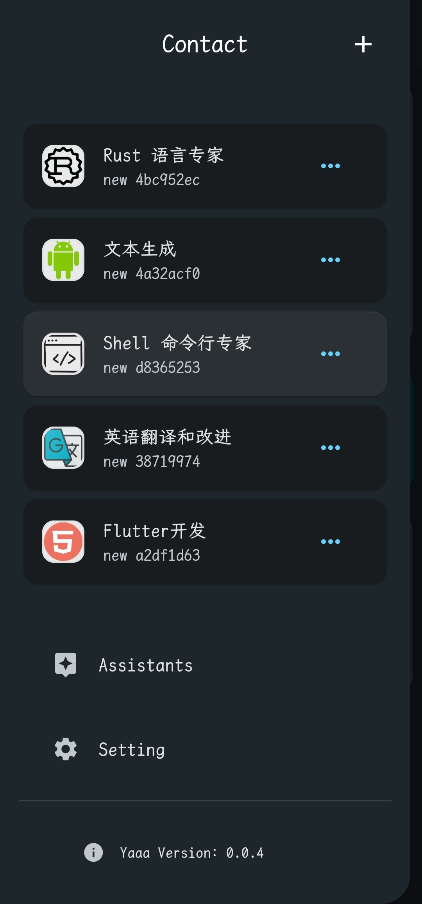
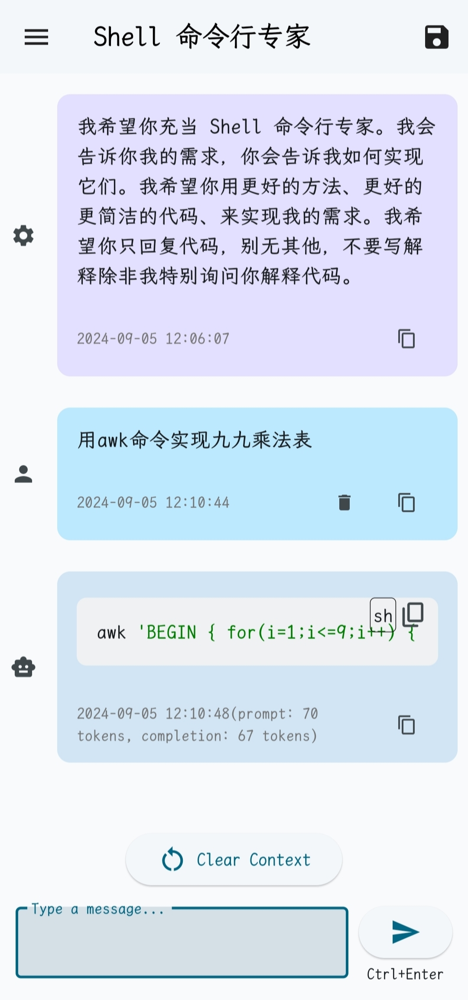

# yaaa

Yet Another AI Assistant. A toy project while learning Flutter.

## Supported Features

- Multi-Platform Support:
  - ✅ Windows
  - ✅ Android
  - 🛠️ working on others...
- Multi-LLM Support:
  - ✅ OpenAI (and any compatible API)
  - ✅ DeepSeek
- Customizable Prompt
- StreamApi
- Continuous Conversation
- Markdown and Latex Support
- Dark Mode
- Keyboard Shortcuts
- Multi-Language Support

## Release

CLick 👉 [here](https://github.com/EluvK/yaaa/releases) to download the latest release.

### Windows Desktop

### Android

  
  

## Noted

**This project is still in development, so there are many bugs and missing features. If you have any ideas or suggestions, feel free to open an issue or pull request.**

## License

No intention to commercialize. This project is licensed under the MIT License - refer to the [LICENSE-MIT](LICENSE-MIT) file for detailed information.
